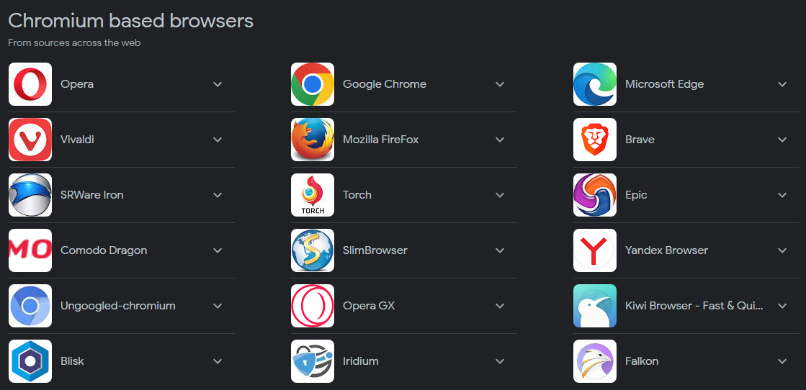

# Chromium based browsers

> Chromium is an open-source browser project that aims to build a safer, faster, and more stable way for all Internet users to experience the web. This site contains design documents, architecture overviews, testing information, and more to help you learn to build and work with the Chromium source code.

# Browsers
As of May 20, 2023
____
|Name| |Download| |Changelog / Blog|
|:----|:----|:----|:----|:----|
|Opera| |https://www.opera.com/download| |https://blogs.opera.com/desktop/|
|Google Chrome| |https://download-chromium.appspot.com| | |
|Microsoft Edge| |https://www.microsoft.com/en-us/edge/download| |https://blogs.windows.com/msedgedev/|
|Vivaldi| |https://vivaldi.com/download/| | |
|Brave| | | | |
|SRWare Iron| | | | |
|Torch| | | | |
|Epic|
|Comodo Dragon|
|SlimBrowser|
|Yandex Browser|
|Ungoogled-chromium|
|Opera GX|
|Kiwi Browser|
|Blisk|
|Iridium|
|Falkon|
|Mozilla FireFox|
